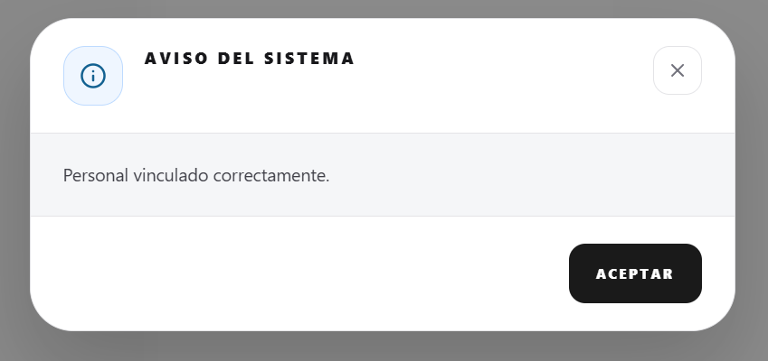

# TASK-0147

Estado
DONE

Tipo
feature/ui

Prioridad
high

Descripción
Rediseño del Team Dashboard y la asignación de personal por EDT.
1. Finalizar la interfaz del TeamDashboardModal para mostrar asignaciones con avatares y métricas de cobertura.
2. Implementar la lógica de transformación a árbol para soportar jerarquías EDT en el dashboard.
3. Integrar el EDTTreeSelector en el ProjectManager para permitir asignaciones por rama.
4. Asegurar la consistencia con la capa de servicios del backend.

Archivos afectados
- backend/app/services/proyecto.py
- frontend/src/components/TeamDashboardModal.jsx
- frontend/src/pages/ProjectManager.jsx
- frontend/src/components/ui/EDTTreeSelector.jsx
- docs/tasks/TASK-0147.md
- docs/CHANGELOG.md

Checklist
[x] Verificar lógica de asignación en `backend/app/services/proyecto.py`
[x] Finalizar UI de `AssignmentNode` en `TeamDashboardModal.jsx`
[x] Integrar métricas de cobertura en `TeamDashboardModal.jsx`
[x] Conectar `ProjectManager.jsx` con `getAssignmentDashboard`
[x] Validar flujo de asignación/desasignación real-time
[x] Refinamiento UX: Eliminar alertas de éxito para agilizar flujo
[x] Actualizar CHANGELOG.md y snapshot
